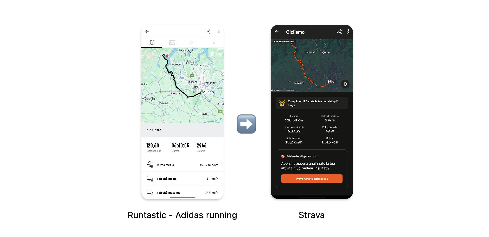
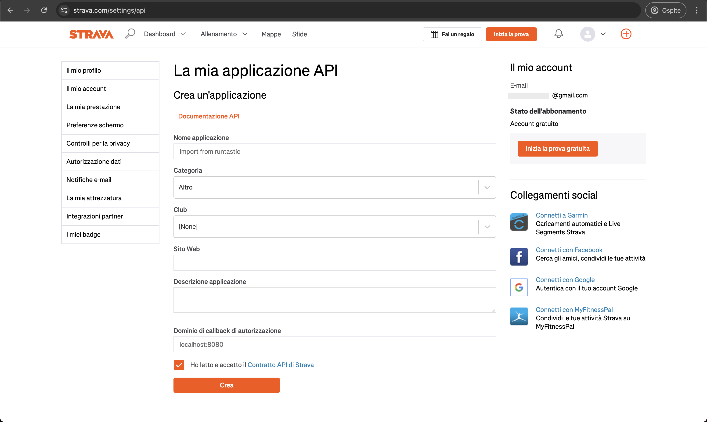
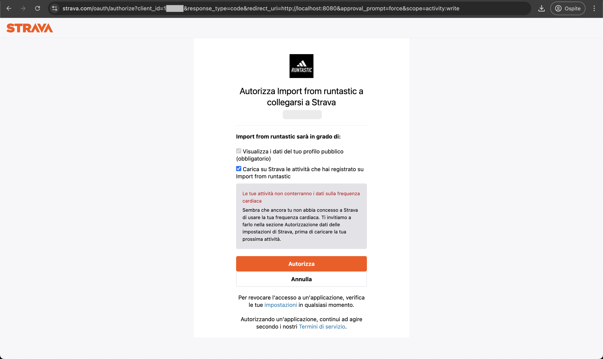
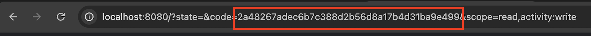

# Runtastic to Strava

Easily transfer your activities from Runtastic (Adidas Running) to Strava.

This tool takes `.gpx` files exported from Runtastic and uploads them to Strava using the [Strava Create Upload API](https://developers.strava.com/docs/reference/#api-Uploads-createUpload). 
All activity metrics, such as distance, pace, and elevation, are recalculated by Strava based on the GPS path provided in the `.gpx` files.




## Requirements

- Python 3
- A Runtastic account
- A Strava account


## Exporting activities from Runtastic

To begin, export your personal data from Runtastic. 

1. Go to **Settings > Account & Data** in the Runtastic website.
2. Request your data export. This process may take a few days.
3. Once the export is ready, you will receive an email with a link to download a `.zip` archive containing your data.
4. Extract the archive and locate the folder `./Sport-sessions/GPS-data`. 
This folder contains GPX files for each activity you've recorded in Runtastic.

You are now ready to migrate your activities to Strava.


## Send activities to Strava

To upload activities to Strava, you must create a Strava API application and obtain an access token.

### Step 1: Create a Strava API application

1. Go to the Strava [API settings](https://www.strava.com/settings/api).
2. Create a new application.
   - Provide any valid URL in the **Website field** (e.g., `http://localhost`).
   - Set the **Authorization Callback Domain** to `localhost`.
3. After creating the application, note your **Client ID** and **Client Secret**.



### Step 2: Configure the script

1. Open `main.py` file.
2. Update the following variables with your data (in alternative you can set env variables)
   - `RUNTASTIC_EXPORT_FOLDER`: Path to the extracted Runtastic folder.
   - `STRAVA_CLIENT_ID`: Your Strava app's Client ID.
   - `STRAVA_CLIENT_SECRET`: Your Strava app's Client Secret.

### Step 3: Run the Script

Execute the script using Python:
```shell
python main.py
```

### Step 4: Application authorization

The program will generate an authorization URL in the terminal.
Copy the URL and paste it into your browser.

Strava will ask you to authorize the app you have just created to login into your account.



After authorizing, you will be redirected to a page on `localhost`. 
The URL will include a `code` parameter. Copy this code.



### Step 5: Uploading activities

1. Paste the `code` into your terminal when prompted. Or save in `STRAVA_ACCESS_TOKEN`
   - This allows the script to login to your Strava account.
2. The program will scan your Runtastic folder and display the number of activities found.
3. The upload process will begin automatically.

Once complete, all your activities will appear in your Strava account.
